<h1 align="center">Hey  I'm Vaishnavi Chakraborty</h1>

  

## 📌 About Me
#🔭 I’m currently working on
- Data Analytics projects focusing on trend analysis and exploratory data analysis (EDA)
- Real-world datasets using MySQL and Python
- Building AI-based mini projects as part of my BCA specialization
#👯 I’m looking to collaborate on
- Data Analytics and AI-based projects
- Open-source projects related to Machine Learning and Data Visualization
- SQL-based database management systems
#🤝 I’m looking for help with
- Advanced Machine Learning algorithms
- Real-time data processing
- Improving model accuracy and deployment strategies
#🌱 I’m currently learning
- Advanced Data Analytics techniques
- MySQL optimization and database management
- Artificial Intelligence and predictive modeling
#💬 Ask me about
- Data Analytics
- Trend Analysis
- Exploratory Data Analysis (EDA)
- MySQL & Database Handling
- Basics of Artificial Intelligence

## 🧠 My Focus Areas
- Data Analytics
- Python programming
- web scrapping
- Data cleaning
- python

## 📊 GitHub Stats & Trophies

  
  

  

  

  

## 🛠️ Languages & Tools

> ## Programming Languages

> ## Frontend

 

> ## Database

   

> ## DevOps & Cloud

 

> ## Tools

 

  

## 🔗 Connect with Me

  

<picture>
  <source media="(prefers-color-scheme: dark)" srcset="https://raw.githubusercontent.com/abozanona/abozanona/output/pacman-contribution-graph-dark.svg">
  <source media="(prefers-color-scheme: light)" srcset="https://raw.githubusercontent.com/abozanona/abozanona/output/pacman-contribution-graph.svg">
  
</picture>

  

